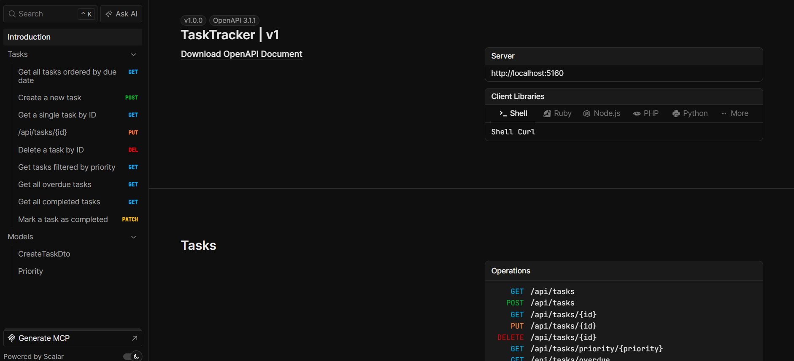

# TaskTracker API

A RESTful task management API built with ASP.NET Core Minimal API, Entity Framework Core, and SQLite.
Designed as a portfolio project to demonstrate practical use of the .NET ecosystem.



## Tech Stack

- **ASP.NET Core Minimal API** (.NET 10)
- **Entity Framework Core** with SQLite
- **Scalar** for interactive API documentation
- **C# Background Services** for concurrent task monitoring

## Features

- Full CRUD operations for task management
- Filter tasks by priority, completion status, or overdue status
- Background worker that monitors and logs overdue tasks on a separate thread
- Enum-based priority system (Low, Medium, High)
- Auto-applied database migrations on startup
- OpenAPI documentation via Scalar UI

## Architecture & Design Patterns

This project follows **SOLID principles** throughout:

- **ITaskService / TaskService** — programming to an interface (Dependency Inversion)
- **TaskFactory** — encapsulates task creation and validation logic (Single Responsibility)
- **DTOs** — separates API contracts from internal domain models (Open/Closed)
- **OverdueTaskWorker** — background service running on its own thread, independent of the HTTP pipeline

## Project Structure

TaskTracker/
├── Models/             # Domain entities
├── Dtos/               # Request/response shapes and mapper
├── Data/               # EF Core DbContext
├── Services/           # Business logic, factory, and background worker
├── Endpoints/          # Minimal API route definitions
└── Program.cs          # App configuration and DI registration

## Getting Started

### Prerequisites

- [.NET 10 SDK](https://dotnet.microsoft.com/download)
- [Git](https://git-scm.com/)

### Run Locally

```bash
git clone https://github.com/Aidan-R-1032/TaskTracker.git
cd TaskTracker
dotnet restore
dotnet run
```

The database is created and migrations are applied automatically on first run.

### API Documentation

Once running, open your browser and navigate to:

https://localhost:{port}/scalar/v1

You will find all available endpoints documented and testable interactively.

## API Endpoints

| Method | Endpoint | Description |
|--------|----------|-------------|
| GET | /api/tasks | Get all tasks ordered by due date |
| GET | /api/tasks/{id} | Get a task by ID |
| GET | /api/tasks/priority/{priority} | Filter tasks by priority (Low, Medium, High) |
| GET | /api/tasks/overdue | Get all incomplete overdue tasks |
| GET | /api/tasks/completed | Get all completed tasks |
| POST | /api/tasks | Create a new task |
| PUT | /api/tasks/{id} | Update an existing task |
| PATCH | /api/tasks/{id}/complete | Mark a task as completed |
| DELETE | /api/tasks/{id} | Delete a task |

## Async & Threading

All database operations use `async/await` via EF Core's asynchronous methods (`ToListAsync`,
`FindAsync`, `SaveChangesAsync`). The `OverdueTaskWorker` runs as a hosted background service
on a separate thread, using `IServiceScopeFactory` to safely resolve scoped dependencies
from a singleton context — a deliberate design decision to avoid captive dependency issues.

## Example Request

Create a new task:

```json
POST /api/tasks
{
  "title": "Review pull request",
  "description": "Review and merge the feature branch",
  "dueDate": "2026-12-01T00:00:00Z",
  "priority": "High"
}
```

Example response:

```json
{
  "id": 1,
  "title": "Review pull request",
  "description": "Review and merge the feature branch",
  "dueDate": "2026-12-01T00:00:00Z",
  "isCompleted": false,
  "priority": "High",
  "createdAt": "2026-06-18T11:00:00Z",
  "isOverdue": false
}
```